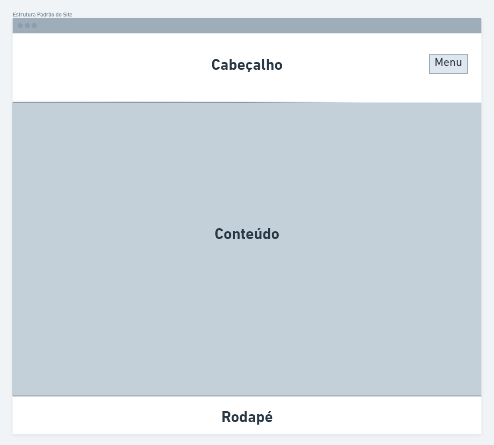
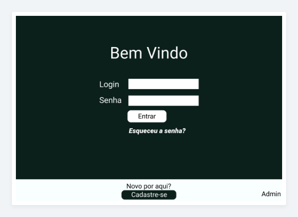
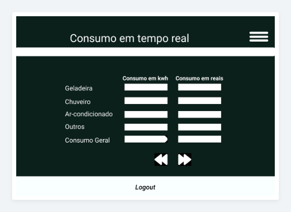
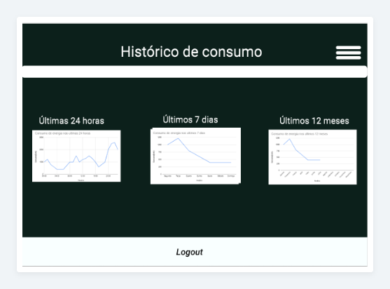
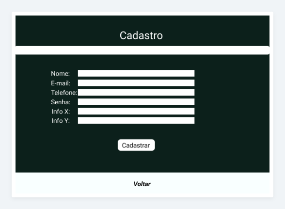
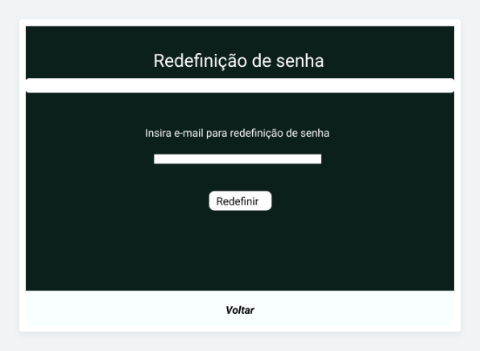

# Projeto de Interface

A interface do aplicativo foi desenvolvida com o objetivo de ser simples para o usuário, com poucos funcionalidades, mas de forma que atenda às suas necessidades.

De maneira geral, as telas do aplicativo permitem a consulta do consumo imediato, bem como a possibilidade de emitir o histórico do consumo (por dia, mês ou ano). Além disso, foi desenvolvida uma tela para que novos usuários possam se cadastrar, redefinir sua senha e ainda, no caso do administrador do sistema, a possibilidade de cadastrar novos equipamentos eletro-eletrônicos, a fim de que esses sejam usados para detalhar o consumo.

## User Flow

O fluxo de usuário (User Flow) do aplicativo mostra quais os caminhos que o usuário poderá seguir para consultar o consumo em tempo real, consultar o histórico de consumo, redefinir a senha e se cadastrar, além de mostrar como o administrador poderá cadastrar novos equipamentos.

## Wireframes

Conforme pode se verificar abaixo, o aplicativo tem como estrutura base três seções: o cabeçalho – onde se encontra o menu –, definido como uma barra superior; o rodapé, definido como uma barra inferior; e o conteúdo, localizado na parte central da tela.

Abaixo seguem as telas que estarão disponíveis para os usuários.
### 1 Tela de Login

### 2 Home

### 3 Histórico de Consumo

### 4 Cadastro de Usuário

### 5 Redefinição de Senha

