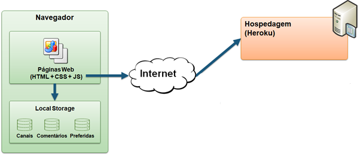
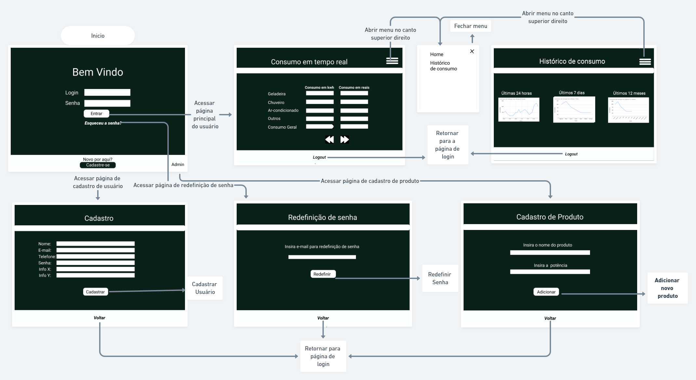

# Arquitetura da Solução

Definição de como o software é estruturado em termos dos componentes que fazem parte da solução e do ambiente de hospedagem da aplicação.

## Diagrama de componentes

Diagrama que permite a modelagem física de um sistema, através da visão dos seus componentes e relacionamentos entre os mesmos.

Os componentes que fazem parte da solução são apresentados na Figura 01.

Figura 01 - Arquitetura da Solução

A solução implementada conta com os seguintes módulos:
- **Navegador** - Interface básica do sistema;
  - **Páginas Web** - Conjunto de arquivos HTML, CSS, JavaScript e imagens que implementam as funcionalidades do sistema;
   - **Local Storage** - armazenamento mantido no Navegador, onde são implementados bancos de dados baseados em JSON. São eles: 
     - **Canais** - seções de notícias apresentadas 
     - **Comentários** - registro de opiniões dos usuários sobre as notícias
     - **Preferidas** - lista de notícias mantidas para leitura e acesso posterior
 - **Hospedagem** - local na Internet onde as páginas são mantidas e acessadas pelo navegador. 

A Figura 02 a seguir ilustra o fluxo do usuário da solução. Assim que o usuário entra na plataforma, ele é apresentado à tela inicial
(Tela 1), onde ele é confrontado com as opões de fazer login, cadastrar-se, acessar como admin ou então recuperar sua senha.

Caso ele opte por seguir pelo primeiro caminho (login), ele é redirecionado para a tela principal (Tela 2), onde pode verificar o consumo de
energia elétrica dos seus aparelhos em tempo real. Nessa tela, o usuário também pode utilizar o menu para ir para a tela de histórico de consumo (Tela 3) ou fazer o logout na barra inferior.

Caso o usuário opte seguir pelo segundo caminho (cadastrar-se), ele é redirecionado para a Tela 4, onde encontrará um formulário de cadastro a ser preenchido.

Caso opte pelo terceiro caminho, o usuário pode acessar a página de admin e adicionar um produto ao sistema e sua potência.

Por último, o usuário pode optar pelo quarto caminho (redefinir senha) e acessar a página de redefinição de senha, onde deverá informar o e-mail para redefinir a mesma. 

Figura 02 - Fluxo do Usuário

## Tecnologias Utilizadas

As tecnologias usadas no projeto serão:

<ul>
  <li> HTML5
  <li> CSS3
  <li> Javascript
  <li> JSON
  <li> IDE: VSCode
  <li> Versionamento: GIT
  <li> Hospedagem: Heroku
</ul>

## Hospedagem

A hospedagem será feita utilizando a plataforma gratuita heroku. 
